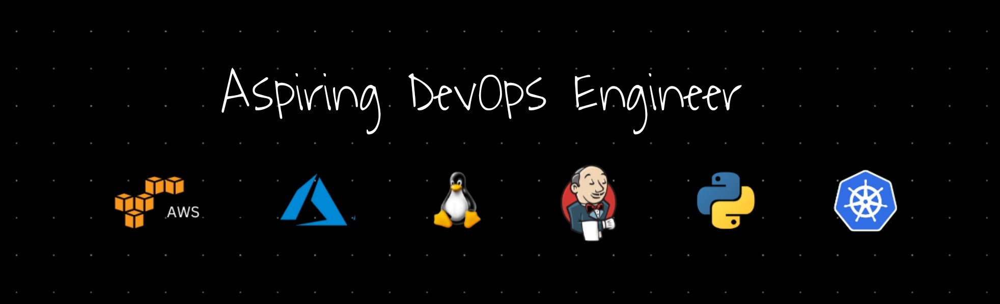

<h1 align="center">Hi👋, I'm Anshu Waghmare from India</h1>

  

<h1 align="center">The DevOps Guy who ♥ automating stuff.</h3>

- 🔭 I'm currently pursuing my Bachelor of Technology degree at Nagpur University.
  
- 🌱 Passionate about enhancing technology and efficiency in software development and operations.

- 👨‍💻Aspiring **DevOps Engineer** with a strong foundation in **DevOps** practices and **Amazon Web Services (AWS)**.

- 💬 Ask me about **DevOps & AWS**

- 💹 Eager to apply these skills to real-world challenges and actively seeking opportunities to contribute knowledge.

- 📧 You can reach me at **anshuwaghmare1111@gmail.com**
  
- ⚡ Fun fact **We guys automate stuff**

---

<h3 align="left">Connect with me:</h3>

---

### :hammer_and_wrench: Languages and Tools :

  &nbsp;
  &nbsp;
  
  &nbsp;
  &nbsp;
  &nbsp;
  &nbsp;
  &nbsp;
  &nbsp;
  &nbsp;
  &nbsp;
  &nbsp;
  &nbsp;

---
